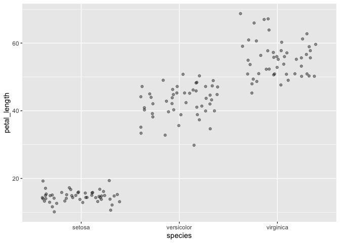
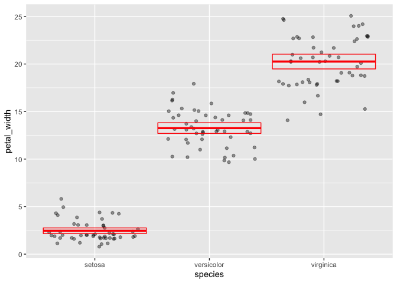
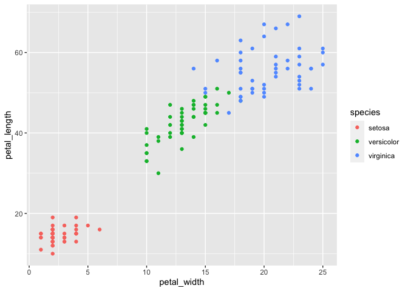

Lab 5
================
Lukas Robinson
2/23/2021

## R Markdown

``` r
library(tidyverse)
```

    ## ── Attaching packages ─────────────────────────────────────── tidyverse 1.3.0 ──

    ## ✓ ggplot2 3.3.3     ✓ purrr   0.3.4
    ## ✓ tibble  3.0.4     ✓ dplyr   1.0.2
    ## ✓ tidyr   1.1.2     ✓ stringr 1.4.0
    ## ✓ readr   1.4.0     ✓ forcats 0.5.0

    ## ── Conflicts ────────────────────────────────────────── tidyverse_conflicts() ──
    ## x dplyr::filter() masks stats::filter()
    ## x dplyr::lag()    masks stats::lag()

``` r
iris<-as_tibble(iris)
```

1.Rename each variable so that it is all lower-case and uses an
underscore \_ instead of a period . in the name (the recommended coding
style in the tidyverse style guide). Print the resulting table.

``` r
flower_sample_size<-rename(
  iris,
  sepal_length=Sepal.Length,
  sepal_width=Sepal.Width,
  petal_length=Petal.Length,
  petal_width=Petal.Width,
  species=Species
)
flower_sample_size
```

    ## # A tibble: 150 x 5
    ##    sepal_length sepal_width petal_length petal_width species
    ##           <dbl>       <dbl>        <dbl>       <dbl> <fct>  
    ##  1          5.1         3.5          1.4         0.2 setosa 
    ##  2          4.9         3            1.4         0.2 setosa 
    ##  3          4.7         3.2          1.3         0.2 setosa 
    ##  4          4.6         3.1          1.5         0.2 setosa 
    ##  5          5           3.6          1.4         0.2 setosa 
    ##  6          5.4         3.9          1.7         0.4 setosa 
    ##  7          4.6         3.4          1.4         0.3 setosa 
    ##  8          5           3.4          1.5         0.2 setosa 
    ##  9          4.4         2.9          1.4         0.2 setosa 
    ## 10          4.9         3.1          1.5         0.1 setosa 
    ## # … with 140 more rows

2.Convert the four numerical variables from cm to mm by multiplying by
10. Print the resulting table.

``` r
mm<-mutate(
  flower_sample_size,
  petal_length = petal_length * 10,
  petal_width = petal_width * 10,
  sepal_length=sepal_length*10,
  sepal_width=sepal_width*10
)
mm
```

    ## # A tibble: 150 x 5
    ##    sepal_length sepal_width petal_length petal_width species
    ##           <dbl>       <dbl>        <dbl>       <dbl> <fct>  
    ##  1           51          35           14           2 setosa 
    ##  2           49          30           14           2 setosa 
    ##  3           47          32           13           2 setosa 
    ##  4           46          31           15           2 setosa 
    ##  5           50          36           14           2 setosa 
    ##  6           54          39           17           4 setosa 
    ##  7           46          34           14           3 setosa 
    ##  8           50          34           15           2 setosa 
    ##  9           44          29           14           2 setosa 
    ## 10           49          31           15           1 setosa 
    ## # … with 140 more rows

3.Calculate sepal area and petal area (area is equal to length
multiplied by width). Print a table with only the variables sepal area,
petal area, and species.

``` r
area<-mutate(mm,sepal_area = sepal_length*sepal_width,
             petal_area=petal_length*petal_width)
species_area<-select(area,sepal_area,petal_area,species
)
species_area
```

    ## # A tibble: 150 x 3
    ##    sepal_area petal_area species
    ##         <dbl>      <dbl> <fct>  
    ##  1       1785         28 setosa 
    ##  2       1470         28 setosa 
    ##  3       1504         26 setosa 
    ##  4       1426         30 setosa 
    ##  5       1800         28 setosa 
    ##  6       2106         68 setosa 
    ##  7       1564         42 setosa 
    ##  8       1700         30 setosa 
    ##  9       1276         28 setosa 
    ## 10       1519         15 setosa 
    ## # … with 140 more rows

4.Calculate the following statistics for the entire dataset from the
sepal length variable and print the resulting table:

sample size maximum value minimum value range median first quartile (q1)
third quartile (q2) inter-quartile range (iqr)

``` r
sepal_summary<-summarize(mm, sample_size = n(),
          max=max(sepal_length),
          min=min(sepal_length),
          range=max-min,
          med=median(sepal_length),
          q1=quantile(sepal_length, .25),
          q3=quantile(sepal_length, .75),
          IQR=IQR(sepal_length)
)
sepal_summary
```

    ## # A tibble: 1 x 8
    ##   sample_size   max   min range   med    q1    q3   IQR
    ##         <int> <dbl> <dbl> <dbl> <dbl> <dbl> <dbl> <dbl>
    ## 1         150    79    43    36    58    51    64    13

5.Calculate the following statistics for each species from the petal
width variable and print the resulting table:

sample size mean standard deviation variance standard error of the mean
approximate 95% confidence interval

``` r
petals_grouped<-group_by(mm, species)
petals_grouped
```

    ## # A tibble: 150 x 5
    ## # Groups:   species [3]
    ##    sepal_length sepal_width petal_length petal_width species
    ##           <dbl>       <dbl>        <dbl>       <dbl> <fct>  
    ##  1           51          35           14           2 setosa 
    ##  2           49          30           14           2 setosa 
    ##  3           47          32           13           2 setosa 
    ##  4           46          31           15           2 setosa 
    ##  5           50          36           14           2 setosa 
    ##  6           54          39           17           4 setosa 
    ##  7           46          34           14           3 setosa 
    ##  8           50          34           15           2 setosa 
    ##  9           44          29           14           2 setosa 
    ## 10           49          31           15           1 setosa 
    ## # … with 140 more rows

``` r
summarize(petals_grouped,mean_width=mean(petal_width))
```

    ## `summarise()` ungrouping output (override with `.groups` argument)

    ## # A tibble: 3 x 2
    ##   species    mean_width
    ##   <fct>           <dbl>
    ## 1 setosa           2.46
    ## 2 versicolor      13.3 
    ## 3 virginica       20.3

``` r
petal_summary<-summarize(
           petals_grouped,
           sampl_size=n(),
           mean=mean(petal_width),
           sd=sd(petal_width),
           var=var(petal_width),
           sem=sd/sqrt(sampl_size),
           ci_upper=mean+2*sem,
           ci_lower=mean-2*sem
)
```

    ## `summarise()` ungrouping output (override with `.groups` argument)

``` r
petal_summary
```

    ## # A tibble: 3 x 8
    ##   species    sampl_size  mean    sd   var   sem ci_upper ci_lower
    ##   <fct>           <int> <dbl> <dbl> <dbl> <dbl>    <dbl>    <dbl>
    ## 1 setosa             50  2.46  1.05  1.11 0.149     2.76     2.16
    ## 2 versicolor         50 13.3   1.98  3.91 0.280    13.8     12.7 
    ## 3 virginica          50 20.3   2.75  7.54 0.388    21.0     19.5

6.Visualize the relationship between petal width and species using a
strip plot.

``` r
mm_striplot<-ggplot(data=mm)+
  geom_jitter(mapping=aes(x=species,y=petal_length), alpha =.4
)
mm_striplot
```

<!-- -->

7.Starting with the previous graph, add the mean and 95% confidence
interval for each species.

``` r
ggplot(data=mm)+
  geom_jitter(mapping=aes(x=species,y=petal_width), alpha =.4)+
  geom_crossbar(
    data=petal_summary,
    mapping=aes(x=species, y=mean,ymax=ci_upper,
                ymin=ci_lower),
    color="red"
  )
```

<!-- -->

8.Visualize the relationship between petal length, petal width, and
species using a scatterplot. Map the two numerical variables to the x
and y axes and map species to the color and shape aesthetics.

``` r
ggplot(data=mm)+
  geom_point(mapping=aes(x=petal_width,y=petal_length,color=species))
```

<!-- -->

``` r
sessioninfo::session_info()
```

    ## ─ Session info ───────────────────────────────────────────────────────────────
    ##  setting  value                       
    ##  version  R version 4.0.3 (2020-10-10)
    ##  os       macOS Catalina 10.15.7      
    ##  system   x86_64, darwin17.0          
    ##  ui       X11                         
    ##  language (EN)                        
    ##  collate  en_US.UTF-8                 
    ##  ctype    en_US.UTF-8                 
    ##  tz       America/Chicago             
    ##  date     2021-02-23                  
    ## 
    ## ─ Packages ───────────────────────────────────────────────────────────────────
    ##  package     * version date       lib source        
    ##  assertthat    0.2.1   2019-03-21 [1] CRAN (R 4.0.2)
    ##  backports     1.2.1   2020-12-09 [1] CRAN (R 4.0.2)
    ##  broom         0.7.3   2020-12-16 [1] CRAN (R 4.0.2)
    ##  cellranger    1.1.0   2016-07-27 [1] CRAN (R 4.0.2)
    ##  cli           2.2.0   2020-11-20 [1] CRAN (R 4.0.2)
    ##  colorspace    2.0-0   2020-11-11 [1] CRAN (R 4.0.2)
    ##  crayon        1.3.4   2017-09-16 [1] CRAN (R 4.0.2)
    ##  DBI           1.1.0   2019-12-15 [1] CRAN (R 4.0.2)
    ##  dbplyr        2.0.0   2020-11-03 [1] CRAN (R 4.0.2)
    ##  digest        0.6.27  2020-10-24 [1] CRAN (R 4.0.2)
    ##  dplyr       * 1.0.2   2020-08-18 [1] CRAN (R 4.0.2)
    ##  ellipsis      0.3.1   2020-05-15 [1] CRAN (R 4.0.2)
    ##  evaluate      0.14    2019-05-28 [1] CRAN (R 4.0.1)
    ##  fansi         0.4.1   2020-01-08 [1] CRAN (R 4.0.2)
    ##  farver        2.0.3   2020-01-16 [1] CRAN (R 4.0.2)
    ##  forcats     * 0.5.0   2020-03-01 [1] CRAN (R 4.0.2)
    ##  fs            1.5.0   2020-07-31 [1] CRAN (R 4.0.2)
    ##  generics      0.1.0   2020-10-31 [1] CRAN (R 4.0.2)
    ##  ggplot2     * 3.3.3   2020-12-30 [1] CRAN (R 4.0.2)
    ##  glue          1.4.2   2020-08-27 [1] CRAN (R 4.0.2)
    ##  gtable        0.3.0   2019-03-25 [1] CRAN (R 4.0.2)
    ##  haven         2.3.1   2020-06-01 [1] CRAN (R 4.0.2)
    ##  hms           1.0.0   2021-01-13 [1] CRAN (R 4.0.3)
    ##  htmltools     0.5.1   2021-01-12 [1] CRAN (R 4.0.2)
    ##  httr          1.4.2   2020-07-20 [1] CRAN (R 4.0.2)
    ##  jsonlite      1.7.2   2020-12-09 [1] CRAN (R 4.0.2)
    ##  knitr         1.30    2020-09-22 [1] CRAN (R 4.0.2)
    ##  labeling      0.4.2   2020-10-20 [1] CRAN (R 4.0.2)
    ##  lifecycle     0.2.0   2020-03-06 [1] CRAN (R 4.0.2)
    ##  lubridate     1.7.9.2 2020-11-13 [1] CRAN (R 4.0.2)
    ##  magrittr      2.0.1   2020-11-17 [1] CRAN (R 4.0.2)
    ##  modelr        0.1.8   2020-05-19 [1] CRAN (R 4.0.2)
    ##  munsell       0.5.0   2018-06-12 [1] CRAN (R 4.0.2)
    ##  pillar        1.4.7   2020-11-20 [1] CRAN (R 4.0.2)
    ##  pkgconfig     2.0.3   2019-09-22 [1] CRAN (R 4.0.2)
    ##  purrr       * 0.3.4   2020-04-17 [1] CRAN (R 4.0.2)
    ##  R6            2.5.0   2020-10-28 [1] CRAN (R 4.0.2)
    ##  Rcpp          1.0.5   2020-07-06 [1] CRAN (R 4.0.2)
    ##  readr       * 1.4.0   2020-10-05 [1] CRAN (R 4.0.2)
    ##  readxl        1.3.1   2019-03-13 [1] CRAN (R 4.0.2)
    ##  reprex        0.3.0   2019-05-16 [1] CRAN (R 4.0.2)
    ##  rlang         0.4.10  2020-12-30 [1] CRAN (R 4.0.2)
    ##  rmarkdown     2.6     2020-12-14 [1] CRAN (R 4.0.2)
    ##  rstudioapi    0.13    2020-11-12 [1] CRAN (R 4.0.2)
    ##  rvest         0.3.6   2020-07-25 [1] CRAN (R 4.0.2)
    ##  scales        1.1.1   2020-05-11 [1] CRAN (R 4.0.2)
    ##  sessioninfo   1.1.1   2018-11-05 [1] CRAN (R 4.0.2)
    ##  stringi       1.5.3   2020-09-09 [1] CRAN (R 4.0.2)
    ##  stringr     * 1.4.0   2019-02-10 [1] CRAN (R 4.0.2)
    ##  tibble      * 3.0.4   2020-10-12 [1] CRAN (R 4.0.2)
    ##  tidyr       * 1.1.2   2020-08-27 [1] CRAN (R 4.0.2)
    ##  tidyselect    1.1.0   2020-05-11 [1] CRAN (R 4.0.2)
    ##  tidyverse   * 1.3.0   2019-11-21 [1] CRAN (R 4.0.2)
    ##  utf8          1.1.4   2018-05-24 [1] CRAN (R 4.0.2)
    ##  vctrs         0.3.6   2020-12-17 [1] CRAN (R 4.0.2)
    ##  withr         2.3.0   2020-09-22 [1] CRAN (R 4.0.2)
    ##  xfun          0.20    2021-01-06 [1] CRAN (R 4.0.2)
    ##  xml2          1.3.2   2020-04-23 [1] CRAN (R 4.0.2)
    ##  yaml          2.2.1   2020-02-01 [1] CRAN (R 4.0.2)
    ## 
    ## [1] /Library/Frameworks/R.framework/Versions/4.0/Resources/library
